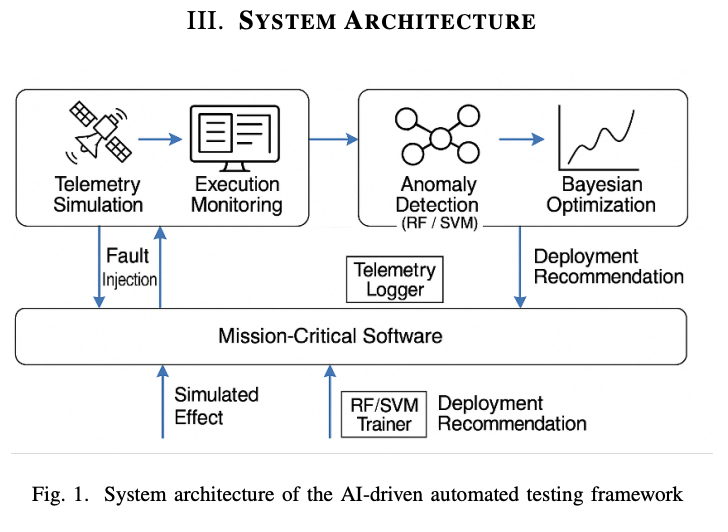
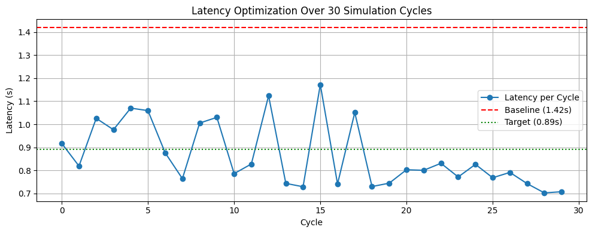
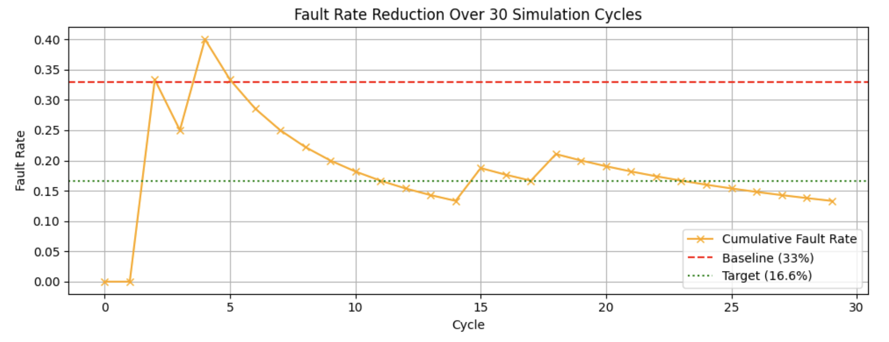

## AI-Driven Mission-Critical Software Optimization for Small Satellites

This repository implements the simulation and optimization framework from the SmallSat 2025 conference paper:

"AI-Driven Mission-Critical Software Optimization for Small Satellites: Integrating an Automated Testing Framework"

Published Paper: https://digitalcommons.usu.edu/smallsat/2025/all2025/124/

## Abstract ##  

Small satellites (SmallSats) have revolutionized our modern digital infrastructure, such as Earth observation, navigation, real-time communications, and deep space exploration, due to their composable design, effectively reduced cost, and accelerated development cycles. However, SmallSat software must function autonomously, often under limited bandwidth, processing power, and computing resources. Pre-launch techniques such as Hardware-in-the-Loop (HIL), Software-in-the-Loop (SIL) and Unit testing are generally used, but often insufficient to detect errors, timing anomalies, fault propagation, or further telemetrybased degradations. This paper presents a Python-based validation framework influenced by recent testbeds like EIRSAT-1, ITASAT-2, and NOS3, integrating telemetry simulation, synthetic fault injection, resource logging, anomaly detection, and runtime tuning using machine learning techniques. Synthetic faults, such as memory saturation and packet delays, are injected across 30 test cycles. The structured logs were provided as input to train Random Forest and SVM models. The average latency rate reduces from 1.42s to 0.89s, and the fault rate reduces from 33% to 16.6% with Bayesian tuning. During practice simulations, the results give support to spot faults earlier and enhance performance. As a result, this research provides a helpful automated framework for developers and aerospace engineers to boost the effectiveness of important software used in small satellites. 

**Index Terms** — small satellites, software validation, machine learning, fault injection, telemetry, autonomous systems

## System Architecture

This architecture diagram shows our AI-driven testbed integrating telemetry simulation, fault injection, model training, and Bayesian optimization for small satellite software profiling.

---

## Overview

This testbed simulates telemetry generation, fault injection, and optimization of software parameters (such as timeout and buffer size) for mission-critical satellite systems. The framework includes:

Random Forest and SVM models for anomaly classification

Bayesian Optimization for latency and fault reduction

Empirical simulation aligned with constraints described in the SmallSat publication

Repository Structure
SmallSatellites/
├── data/
│   └── simulated/                 # Generated telemetry files (.csv)
├── framework/                    # Core Python scripts
│   ├── simulator.py              # Synthetic telemetry generator
│   ├── fault_injection.py        # Injects faults into telemetry
│   ├── model_training.py         # Trains machine learning models
│   ├── model_comparison.py       # Compares classifier performance
│   └── bayesian_optimizer.py     # Bayesian optimization logic
├── notebooks/
│   └── demo_testbed.ipynb        # End-to-end testbed (30-cycle simulation)
├── requirements.txt
└── README.md

Sample Results (from demo_testbed.ipynb)

Average Latency: approximately 0.86 seconds

Fault Rate: approximately 13.33 percent

Note: These results are representative. Due to randomized simulation and noise, actual output may vary per run. The SmallSat paper reports an average fault rate of ~16.67 percent based on 30-cycle experiments.

## Experimental Results

### Latency Optimization Over 30 Cycles

### Cumulative Fault Rate Convergence

> *Note: These graphs are generated using the `demo_testbed.ipynb` notebook over 30 Bayesian-optimized simulation cycles.*

Setup Instructions
# Clone the repository
git clone https://github.com/your-username/SmallSatellites.git
cd SmallSatellites

# Create and activate virtual environment
python3 -m venv venv
source venv/bin/activate

# Install dependencies
pip install -r requirements.txt

Running the Framework
# Step 1: Generate clean telemetry
python3 framework/simulator.py

# Step 2: Inject faults into telemetry
python3 framework/fault_injection.py

# Step 3: Train classification models
python3 framework/model_training.py

# Step 4: Compare classifier performance
python3 framework/model_comparison.py

# Step 5: Optimize software parameters
python3 framework/bayesian_optimizer.py

Alternatively, open and run the entire workflow inside:

notebooks/demo_testbed.ipynb

Author

Vishnupriya S. Devarajulu
Software Engineer | AI Researcher
LinkedIn: https://www.linkedin.com/in/vishnupriyadevarajulu

Citation

If you use this codebase for research or implementation purposes, please cite the original paper:

@inproceedings{devarajulu2025smallsat,
  title={AI-Driven Mission-Critical Software Optimization for Small Satellites},
  author={Devarajulu, Vishnupriya S.},
  booktitle={Small Satellite Conference (SSC)},
  year={2025}
}

Acknowledgments

Utah State University / NASA Small Satellite Conference

NASA-STD-8739.8, IEEE 1012, IEEE 730

Libraries used: scikit-learn, scikit-optimize, matplotlib